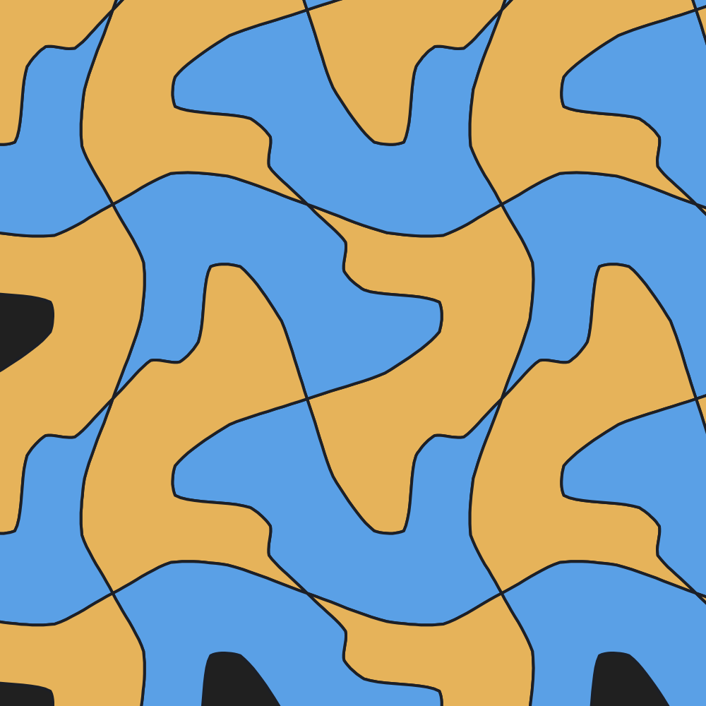

# Tessala

**Escher-style tessellations, with AI.**

🔗 **Live app: https://rnorlund.github.io/tessala/** — runs entirely in your browser, nothing to install.

Tessala is a single-file web app for designing repeating tilings the way M.C. Escher did — pick a symmetry, warp one tile, and watch it interlock across the plane. Then turn the abstract tile into a picture: draw inside it, or hand the shape to an AI image model and drop the result back in, clipped to fit.



## Features

- **Tile editor** — pick a symmetry, drag edge control points; the matching edges auto-update so it always tiles seamlessly. Smooth (Catmull-Rom) curved edges with an adjustable curvature.
- **Six core symmetries** — square & hex translation, 2/3/4-fold rotation, and glide reflection — plus an **Advanced engine (81 isohedral types)** powered by [tactile.js](https://github.com/isohedral/tactile-js).
- **Idea generator** — an evolutionary tool: generate a batch of random tiles, ♥ the ones you like, and *evolve* the next batch from your favorites. Knobs for wild / detail / lobe / spike / curve, and "mix patterns".
- **AI fill workflow** — export the exact tile shape as a transparent PNG, prompt an image model (ChatGPT, etc.) to fill it, then re-import — the image is clipped to your tile and repeated (and mirrored, for glide). Includes zoom/nudge fit, a gap/water color, "blend light areas", and a **trace-behind-tile** mode for sculpting a tile to match a creature.
- **Stamp mode** — repeat a whole image across the tiling (great for layered "flock" patterns).
- **Freehand drawing**, two-tone coloring, PNG export, and save/load designs as self-contained `.json` projects (image baked in).

## Use it

It's a single HTML file. Clone and open `index.html` in a browser:

```sh
git clone https://github.com/rnorlund/tessala.git
cd tessala
open index.html      # macOS  (or just double-click it)
```

No build, no server, no dependencies to install. The only bundled library is `vendor/tactile.js` (loaded locally).

## How it works (the short version)

Each tile is a fundamental domain whose edges are *paired* by the symmetry's isometries (translation, rotation, glide). Editing one edge updates its partner via that transform, so the boundary always tiles. Curved edges are sampled per-edge (slaves derived by transforming the master's samples) and tapered to zero at the corners, so seams stay exact at any curvature. The advanced engine maps tactile.js's 81 isohedral prototiles + placement transforms into the same renderer.

## Credits

- Tessellation isohedral engine: **[tactile.js](https://github.com/isohedral/tactile-js)** by Craig S. Kaplan (BSD-3-Clause).
- Tessellation theory: Grünbaum & Shephard (*Tilings and Patterns*), Heesch types, and Kaplan & Salesin's *Escherization*.

## License

[PolyForm Noncommercial 1.0.0](LICENSE.md) — free for personal, educational, and other noncommercial use. Commercial rights reserved by the author.
